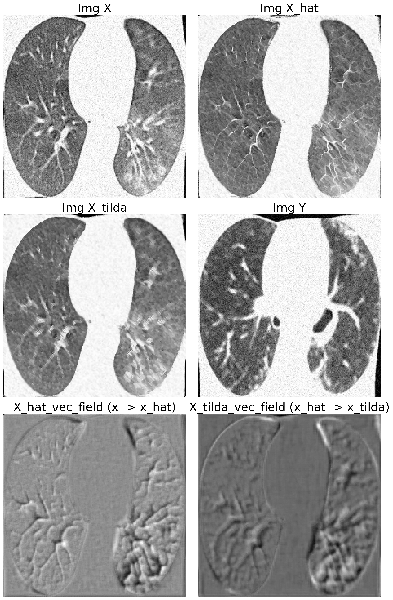
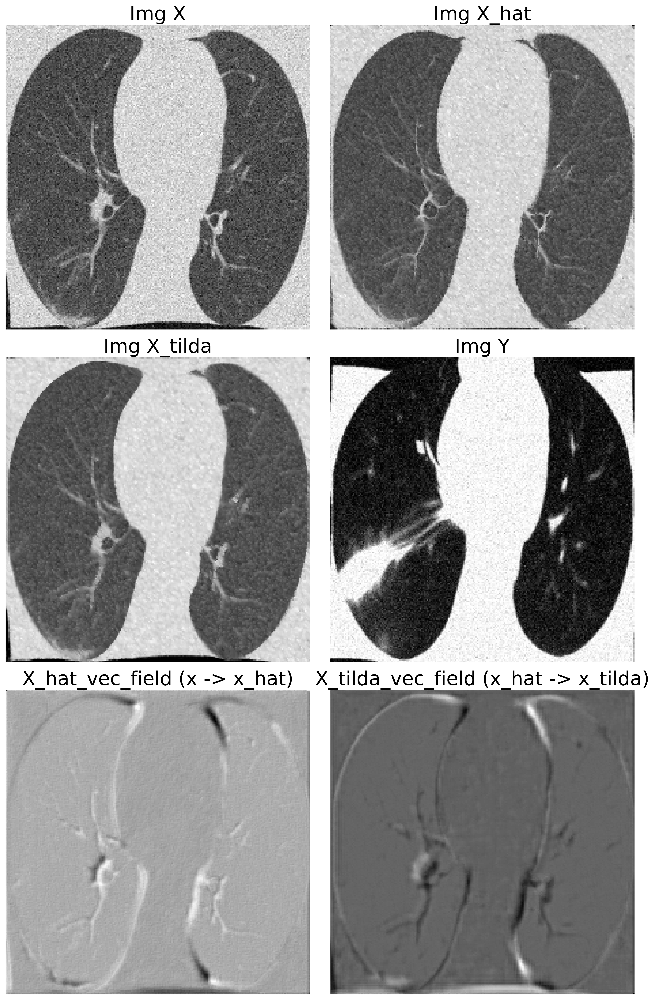

# Lung_Project
A project attached to the course 'image and video processing 2023'. This project focused on applying a saliency map method for interpreting deep learning models.
## Goals
This project contains two main components:
- Utilizing a pre-trained ResNet18 model to classify the covid lungs and control lungs;
- Implementing an image-to-image translation framework to generate visualizations with warped images. This approach allowed for a better understanding of the differences between COVID-infected lungs and control lungs from the perspective of the classification model.

For image-to-image translation framework, please read the paper: [Going Beyond Saliency Maps: Training Deep Models to Interpret Deep Models](https://www.ncbi.nlm.nih.gov/pmc/articles/PMC8451265/) and the according [github repo](https://github.com/ZucksLiu/DeepInterpret). Minor changes are made during implementation compared with the original paper.

## Results
Two examples are shown below:
Example 1.                     |  Example 2
:-----------------------------:|:------------------------------:
  |  

where Img_X and Img_Y are the covid and control lung respectively; Img_X_tilda and Img_X_hat are the reconstructed covid and control lung respectively; X_hat_vec_field is the warping image from convid to control and X_tilda_vec_field shows the opposite direction.
